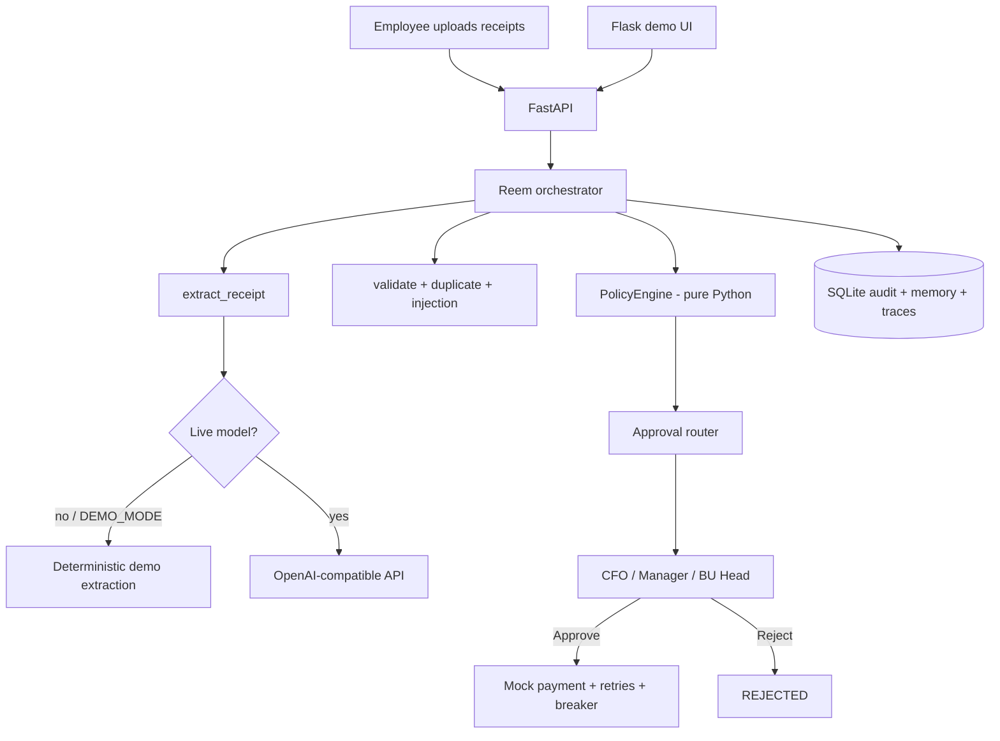

# AI Reimbursement Employee — Reem

Conference prototype for **The Real Story Behind the AI Employee**.

Reem processes corporate travel reimbursements: read receipts, classify expenses, apply **code-based** policy, stop for a human when money moves, then mock a payment.

## Principle

| Who | Decides |
| --- | --- |
| **AI** | What requires intelligence — extract, classify, summarize |
| **Code** | What requires certainty — totals, thresholds, duplicates, state, permissions |
| **Humans** | What requires authority — approve pay, resolve exceptions |

The LLM never makes the final financial decision.

## What this prototype is NOT

- Not a real finance system
- Payment is mocked
- Notifications are mocked
- Authentication is a role dropdown (demo-grade)
- Document extraction is demo-grade (filename + text heuristics, or an optional OpenAI-compatible model)
- Policy is two simple threshold versions
- Do not connect this to a bank, payroll, or production identity provider

## Architecture

```text
UI (Flask) → API (FastAPI) → Agent orchestrator → Tools → Policy engine → SQLite
```



## Setup

Python 3.11+.

```bash
cd aws-talk
python -m venv .venv
.venv\Scripts\activate
pip install -r requirements.txt
copy .env.example .env
```

On macOS/Linux: `source .venv/bin/activate` and `cp .env.example .env`.

## `.env` configuration

| Variable | Purpose |
| --- | --- |
| `DEMO_MODE=true` | Mock extraction and the full workflow. **Use this for the talk.** |
| `AI_API_KEY` | OpenAI-compatible key. Empty = stay in demo. |
| `AI_BASE_URL` | e.g. `https://api.openai.com/v1` |
| `AI_MODEL` | Deployment / model name. Empty = demo. |
| `DATABASE_URL` | Default `sqlite:///./data/reem.db` |
| `MAX_AGENT_LOOPS` | Loop detector limit (default 3) |
| `PAYMENT_RETRY_LIMIT` | Payment retries (default 3) |
| `CIRCUIT_BREAKER_THRESHOLD` | Failures before breaker opens (default 3) |
| `RATE_LIMIT_PER_CLAIM` | Tool calls per claim (default 40) |

Live model is used only when **all** of these are true: `DEMO_MODE=false`, `AI_API_KEY` set, `AI_MODEL` set.

The UI always shows **DEMO MODE** or **LIVE MODEL**. Mocked results are never labeled as model output.

## Run

Both processes (recommended):

```bash
python run.py
```

Or separately:

```bash
uvicorn app.main:app --host 127.0.0.1 --port 8000
```

```bash
python flask_ui/app.py
```

| Surface | URL |
| --- | --- |
| Flask UI | http://127.0.0.1:5000/ |
| FastAPI | http://127.0.0.1:8000/ |
| Swagger | http://127.0.0.1:8000/docs |

## API

| Method | Path |
| --- | --- |
| POST | `/claims` |
| POST | `/claims/{id}/process` |
| GET | `/claims` |
| GET | `/claims/{id}` |
| GET | `/claims/{id}/trace` |
| POST | `/claims/{id}/approve` |
| POST | `/claims/{id}/reject` |
| GET | `/approvals` |
| GET | `/policies` |
| POST | `/policies/activate` |
| POST | `/demo/duplicate` |
| POST | `/demo/failure/payment` |
| POST | `/demo/failure/circuit` |
| POST | `/demo/failure/loop` |
| POST | `/demo/prompt-injection` |

Identity headers (Flask sends these): `X-Role`, `X-User`, `X-Employee-Id`.

## Seeded talk data

| Claim | Total | Approver (policy v1) |
| --- | --- | --- |
| CLM-1001 Rahul · Bangalore Client Visit | ₹24,550 | CFO |
| CLM-A Anita | ₹4,500 | Manager |
| CLM-B Rahul | ₹24,550 | CFO |
| CLM-C Vikram | ₹75,000 | CFO + Finance |

## 3–5 minute demo

1. Open http://127.0.0.1:5000/ — *Meet Reem.*
2. Click **Open talk claim — Rahul ₹24,550** (or upload `hotel` / `uber` / `meal` / `flight` files).
3. Show extracted lines and **Total ₹24,550**.
4. Show **Policy Decision → CFO**.
5. Switch role to **CFO**. **Approve**.
6. Payment completes. Open **Agent Trace**.
7. **Demo Scenarios → Duplicate**. Second invoice blocked.
8. **Payment API failure**. Fail → retry → success.
9. **Payment service down**. Three fails → circuit open → exception.
10. **Prompt injection**. Warning shown. Policy still CFO.
11. Switch to **ADMIN**. Policies: activate **v2**. Same ₹24,550 would route to **BU Head**.
12. Close: *The LLM is only one part of the AI employee.*

## Concept map

### Think

| Concept | Where |
| --- | --- |
| Tool calling | `app/agent/tools.py` — UI "Reem's Activity" |
| Short-term memory | Current claim row + compact context JSON |
| Long-term memory | `employee_memory` table |
| Planning | Explicit state machine in `orchestrator.py` |
| Structured outputs | `ExtractedExpense` Pydantic model |
| Routing | Expense type lanes + policy approver |
| State management | `ClaimState` + allowed transitions |

### Act reliably

| Concept | Where |
| --- | --- |
| Failure recovery | Payment retries |
| Cost control | Trace cost + compact context (no full history to the model) |
| Deterministic workflows | Policy engine, totals, state transitions |
| Agent evaluation | `/evaluation` demo dataset |
| Human-in-command | Workflow stops at `APPROVAL_REQUIRED` |
| Loop detection | `MAX_AGENT_LOOPS` + demo scenario |
| Timeouts & retries | httpx timeout; payment retry loop |
| Circuit breaker | `PaymentService` |
| Idempotency | Duplicate invoice+amount; payment `already_paid` |
| Concurrency | Parallel receipt extraction |
| Rate limiting | Per-claim tool cap |
| Caching | Policy lookup cache |
| Tracing | `/claims/{id}/trace` |

### Control & security

| Concept | Where |
| --- | --- |
| Guardrails | Injection scanner; document treated as data |
| Observability | Audit events + tool traces |
| Prompt injection | Demo scenario 5 |
| Tool permissions | `TOOL_PERMISSIONS` in `app/security.py` |
| Least privilege | Employee sees own claims; finance-only payment tool |
| AuthN / AuthZ | Role header + approve-role map |
| Data privacy | Local SQLite; no keys in code |

### Change

| Concept | Where |
| --- | --- |
| Versioning & rollback | Policy v1 / v2 + activate / rollback |
| Context management | `CompactContext` only — not the full conversation |

## Hosting

GitHub Pages serves static files only. This app is FastAPI + Flask + SQLite. Pages cannot run it.

Put secrets in GitHub → Settings → Secrets and variables → Actions:

```text
DEMO_MODE
AI_API_KEY
AI_BASE_URL
AI_MODEL
SECRET_KEY
```

Do not commit `.env`. Use `.env.example` as the name list.

For a live URL, deploy the Python process to Azure App Service, Render, Railway, or a VM. Then wire those same secret names.

## Tests

```bash
pytest -q
```

Covers policy bands, approval routing, duplicate/payment idempotency, retries, circuit breaker, injection, and HTTP demo flows.

## Production gap (if this were real)

- Real IdP, SSO, audit-grade auth
- Virus-scan and OCR for receipts
- Human-reviewed extraction, not blind model trust
- Real payment rail with dual control
- Durable queue, not in-process breaker
- Encrypted PII, retention, legal hold
- Policy as signed, tested, change-managed config
- Evaluation on labeled production traffic, not 15 fixtures
